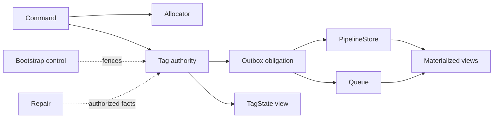

# Architecture

This library serializes event writes per tag, then derives global delivery and
read models from durable facts. The boundary is deliberate: a successful local
append is an acceptance of durable tag work, not a promise that every derived
view is already visible.

## Terms and design philosophy

An **authority** owns the durable fact that decides ordering, membership, or
control. A **derived view** can be rebuilt from an authority and must not make
an authority claim. A **safe view** is exposed only through a proven frontier;
an **unsafe view** is an explicit, tentative read that never advances that
frontier.

The design has four rules:

1. Serialize the event and its tag-local obligations where the tag is owned.
2. Allocate sortable IDs once and carry the same identity through every
   delivery attempt.
3. Start global delivery only after tag-local durable acceptance, with the
   outbox as recovery.
4. Make uncertainty visible. The guarded command, conformance, bootstrap, and
   repair-operator routes fail closed on unknown configuration or unsafe
   authority checks; read, queue, and scheduled paths report their own
   unavailable or progress outcomes rather than pretending success.

A sortable unique ID (SUID) is the ordering value allocated once and carried
through append, delivery, and read-model catch-up.

## Two authoritative scopes

The scopes are complementary, not interchangeable.

| Scope | Authority | What it decides | What it does not decide |
| --- | --- | --- | --- |
| Per tag `(serviceId, tag)` | Tag Durable Object | Event order, tag membership, head, local receipt, outbox obligation, reservation, fence, and repair facts | Global delivery completion or a projector's current state |
| Global event delivery | PipelineStore | Global event record, tag membership/receipt delivery facts, and completeness evidence | Per-tag order, per-tag conflict claims, or tag repair truth |

The Tag authority is the source for TagState and for repair. The PipelineStore
is the global delivery record used by downstream work. A global row cannot make
a missing tag append true, and a projection cannot make a global receipt true.

## Component ownership

| Component | Ownership boundary |
| --- | --- |
| Allocator | Owns the allocation vector, sortable-ID monotonicity, and allocator lineage. It does not append an event or certify a tag. |
| Tag Durable Object | Owns the per-tag transaction: event, membership, outbox obligation, head, and receipt are committed together. Reservations and partial-write fences are tag-local facts. |
| PipelineStore | Owns the global delivery/admission record and its completeness facts. Those facts can be written by source registration before the first append, fast admission, ordinary outbox/Queue delivery, the completeness reconciler, or bootstrap provider admission. It is not a replacement for Tag authority. |
| Journal | Is a retained repair-workset and observation store. Normal commits do not write it; its records are evidence and operator-supplied repair input, never the authority for a tag append or terminal write truth. |
| TagState | Caches one projector's fold for one tag. It is derived from the Tag source and can be rebuilt. |
| Materialized views | Serve queryable read models. Safe catch-up advances only through a proven frontier; an explicitly selected unsafe lane is tentative and never advances the safe checkpoint. See [safe-lane scheduling](safe-lane.md). |
| Queue | Owns durable outbox delivery, acknowledgement, retry, and dead-letter recovery. It does not own event order or tag truth. |
| Doorbell | Provides a bounded delivery signal or fast hint. A misconfigured direct doorbell in fail-fast mode refuses the append; a failed or late signal otherwise leaves the outbox/Queue path responsible for recovery. |
| Bootstrap coordinator | Owns import planning, fencing, leases, progress, verification, and the transition to ready operation. It does not become the long-term event authority. See [bootstrap import](SDT-G21-bootstrap-import.md). |
| Repair worker | Executes an explicit, scoped repair using fresh Tag facts. It can roll forward an authorized missing append, audit an exclusion, and clear an eligible fence; it never rewrites the original outcome. |

## Acceptance, delivery, and visibility

For a multi-tag command, the runtime reserves only the consistency tags,
allocates a single vector, and asks each candidate Tag authority to append.
Each successful Tag append is locally durable before derived delivery begins.
A Queue delivery can then record the global event and completeness facts, while
a doorbell may shorten the time to an unsafe view. Neither path changes the
authority order.

Multi-tag work is best effort, not atomic across tags. Zero or more Tags can
commit while other Tags fail. The `partial_write` result reports zero or more
written tags and missing facts, and the durable partial fact is the tag-local
fence plus the `partial_write` body. It is not retryable by replaying the
command. Repair runs only from an explicit Journal workset supplied by the
operator after inspecting fresh Tag facts; the runtime ships no public route
that creates a Journal `PARTIAL` workset, and there is no automatic end-to-end
repair path. Do not infer completion from a Journal observation, a Queue
acknowledgement, or a derived view.

When the host supplies a maximum SUID, safe materialized-view catch-up requires
a source-complete frontier bounded by that maximum and ordered advancement.
Without a supplied maximum SUID, the portable scheduled path uses its
time-based `SafeWindow` rather than claiming an equivalent source-complete
frontier. Unsafe reads are opt-in and can expose a tentative row before that
proof, but the unsafe lane cannot move the safe head. A missing projection,
incoherent head, or unavailable source is an unavailable or transport result,
not an empty success.

The local ordering and derived-delivery details remain in the [write-path
contract](write-path.md). The public result and repair actions are centralized
in the [result and repair matrix](#result-and-repair-matrix).

## TagState rebuilds

TagState is identified by service, tag, and projector. Its only rebuild source
is the existing Tag authority's incremental event stream. A missing cache or a
projector-version change starts a rebuild from the projector's empty state at
a frozen frontier. Each read folds one bounded source page (at most the
runtime page limit), then persists the cursor and accumulator when more work
remains; there is no background TagState worker.

Only a complete rebuild becomes `READY`. A rebuilding response is explicit;
an unknown projector, bad checkpoint, unstable frontier, or source failure is
an error. TagState never returns an empty success to hide a missing source, and
normal operation never reconstructs Tag authority from TagState or a
downstream store.

## Bootstrap authority transition

Bootstrap is a controlled transition into a fresh target, not a second source
of event truth.

1. The plan operation comes first. The coordinator's `/plan` parses and
   validates the complete versioned dump, canonical digest, counts, tag
   counts, SUID order, and high watermark; checks explicit fresh-target
   evidence; and persists the import plan, dump, digest, lease, fencing epoch,
   and progress. No Tag or allocator import write precedes this plan
   boundary. The operator import route does not itself check that a plan
   exists before provider admission, so run `/plan` first.
2. During the later import operation, the operator also parses the dump and
   the provider adapter performs PipelineStore admission. This is a separate
   provider-side write, not a coordinator state- or epoch-gated operation. The
   coordinator `/import` then validates the matching import ID, fencing epoch,
   and import state before admitting event and membership facts into each Tag
   and seeding the target allocator after the imported high watermark is known.
3. The coordinator `/verify` compares each imported Tag's head, event count,
   and event fields with the validated dump, and compares the dump event count
   with its manifest. The operator then adds the provider adapter's verification
   (currently a provider event-count check), any optional read-model hook, and
   `/ready`. It does not make `/verify` a TagState, completeness, global-store,
   or allocator reread. Only successful coordinator verification and the
   optional checks allow `READY` and release normal command admission.

An error during `/import`, after it has entered `IMPORTING`, does not
automatically enter `FAILED`: it remains fenced in `IMPORTING`, where the
operator can resume or abort. A failure after `/import` reaches `VERIFYING`
stays fenced in `VERIFYING`; the operator aborts and then imports again from
`FAILED`. Rejections before `/import` enters `IMPORTING` leave the coordinator
state unchanged, although provider admission may already have written. Only the operator abort
route writes `FAILED` with `operator_abort`. `READY` permanently closes the
coordinator's import route and each Tag's `/bootstrap/admit` import route;
that closure does not make provider-adapter PipelineStore admission part of the
same route or state machine. After the transition, normal commands use the
ordinary Tag and allocator authorities; downstream state is not used to
rebuild those authorities. The detailed preflight and transition contract is
in [bootstrap import](SDT-G21-bootstrap-import.md).

An empty dump does not manufacture an event or a sentinel head; the first
normal allocation establishes the next authority fact.

## Guarantees and non-guarantees

Guarantees:

- Tag authorities own per-tag order, membership, heads, and durable partial
  fences; allocator seeding follows the validated imported high watermark.
- The coordinator's fresh-target plan and `/import` state/epoch checks precede
  Tag and allocator import writes. Provider-adapter PipelineStore admission is
  a separate write after operator parsing and before coordinator import
  admission; `READY` follows coordinator verification plus the provider and
  optional read-model checks.
- Ambiguous commit results are surfaced for reconciliation, not silently
  replayed.

Non-guarantees:

- A multi-tag command is not atomic, and a successful local append does not
  mean derived views are current.
- Journal observations do not prove a write and do not create an automatic
  repair workflow.
- Provider-adapter admission, telemetry, and downstream records do not replace
  Tag or allocator authority.

## Result and repair matrix

`ExecuteResult` is the public union of nine kinds. “Before dispatch” means the
executor has not sent the commit request; “after dispatch” means the request
could have reached a Tag authority. Automatic retry is limited to `conflict`:
`SekibanExecutor` defaults to one commit-conflict retry and does not cap an
explicit value, `ClaimLedgerExecutor` defaults to zero and caps the value at
one, and snapshot-only execution uses zero. `ClaimLedgerExecutor` also retries
a `conflict` raised during a read. Other kinds are not automatically replayed.

| Kind and important codes | Producer | May a write have happened? | Executor retry state | Caller action |
| --- | --- | --- | --- | --- |
| `committed` | Commit outcome accepted by the executor; no failure code | Yes. Commit path after dispatch; every requested Tag append accepted and its local event/outbox/receipt is durable. Derived delivery may still lag. | A preceding conflict may have used the configured retry; no further automatic retry. | Use the response. Read through the safe/unsafe visibility contract when a view must catch up; no repair is implied. |
| `noop` | Domain decision or executor's no-candidate check; normally no code | No. Read/command path before commit dispatch. | No retry for this kind. | Do nothing, or show the domain reason. |
| `rejected` — domain reject, `command_rejected`, `credential.rejected` | Domain decision or executor classification of a definite refusal | A domain reject is before dispatch and carries the V1 reject code or an application code. A definite server refusal of a dispatched commit (`command_rejected` or `credential.rejected`) states that no write happened. | No retry for this kind. | Fix the command, credentials, or policy and let the caller decide whether to try again; do not replay unchanged input automatically. |
| `conflict` — `consistency_conflict` | Commit reservation outcome or executor classification | No accepted Tag append. The reservation refusal is on the commit path before Tag append; cleanup is a separate durable action. | Yes, only this kind is retried: one default retry for `SekibanExecutor`, zero default and a one-retry cap for `ClaimLedgerExecutor`; snapshot-only is zero. ClaimLedger also retries a read conflict. | Retry with fresh claims when the command is safe to repeat. If the conflict remains, stop and surface it. |
| `partial` — `partial_write` | Commit outcome after Tag fan-out | Yes. Commit path after dispatch; zero or more Tag transactions may have committed and other Tags may not. The result carries written/missing facts and `retryable: false`; written tags may be empty. | No automatic retry. | Stop command replay. Inspect fresh Tag facts and use an explicit operator-supplied Journal workset for repair; preserve the original partial outcome. |
| `timeout` — `aborted` | Executor classification of caller cancellation or abort | A read or pre-dispatch command has no application write; if a commit was dispatched, the write may have happened. | No automatic retry. | Stop automatic work. If dispatch may have happened, reconcile; never blindly reissue. |
| `timeout` — `timeout` | Executor classification of a deadline | Before commit dispatch, no application write; after dispatch, the write may have happened. | No automatic retry. | Before dispatch, retry only under a renewed budget. After dispatch, reconcile before retry; never blindly reissue. |
| `timeout` — `unknown_outcome` | Executor classification of an ambiguous commit outcome | A dispatched write may have happened; a read-side use is not applicable. | No automatic retry. | On a read path, this is not applicable; on a commit path, reconcile the logical operation and never blindly reissue. |
| `unavailable` — `projection_unavailable` | Executor classification | Read-side unavailability has no commit write. | No automatic retry. | On a read path, renew the read budget before retrying projection work; on a commit path, reconcile before retry and never blindly reissue. |
| `unavailable` — `read_unavailable` | Executor classification | Read-side unavailability has no commit write. | No automatic retry. | On a read path, retry a read only under a renewed budget; on a commit path, reconcile before retry and never blindly reissue. |
| `unavailable` — commit-side unavailable (any `unavailable` code returned by a commit reply) | Executor classification | After dispatch, the commit may have written. | No automatic retry. | On a read path, renew the read budget before retrying projection work; on a commit path, reconcile before retry and never blindly reissue (after dispatch). |
| `transport` — `transport`, `http_error`, `authority_unavailable` | Executor classification after sanitizing an adapter or response | Read-path failures have no application write. A commit-path failure before dispatch has none; after dispatch may have written. | No automatic retry. | On a read path, inspect or reconcile rather than blindly retry. For a dispatched commit, reconcile before retry and never blindly reissue (after dispatch). |
| `transport` — `incoherent_read_snapshot` | Executor classification after sanitizing an adapter or response | A read-path failure has no application write; a dispatched commit response may still be ambiguous. | No automatic retry. | On a read path, do not infer absence or blindly retry (adapter-backed live read); on a commit path, inspect or reconcile and do not infer definiteness. |
| `invalid` — `domain_authoring_error` | Domain validation or executor classification | No. Domain authoring failure is rejected before commit dispatch. | No automatic retry. | Fix the command or domain authoring; nothing was sent. |
| `invalid` — `invalid_execute_options`, `invalid_command_input`, `executor.snapshot_missing`, `scope.mismatch`, unsupported input | Domain validation or executor classification | No. Input, composition, or snapshot failure is rejected before commit dispatch. | No automatic retry. | Fix the command, domain input, snapshot, or configuration, then submit a new intentional operation. |

The runtime has one related boundary code: `partition_registration_unavailable`
is a retryable refusal before the first append on a newly configured source
partition. It writes no Tag event, outbox obligation, or local receipt but
leaves a tag-local partial-write fence. It is not `unknown_outcome`. A generic
client that does not know this runtime code sanitizes it as transport, so a
boundary adapter should preserve the explicit pre-write handling when it is
available.

## Composition rules

These are rules for composing deployment components. They are not claims that
the runtime library enforces every deployment choice.

* A component without a public command surface refuses command, operator, and
  conformance routes. Its explicitly named delivery entrypoint remains
  available. Missing or unknown component configuration fails closed on those
  guarded routes only; read, queue, and scheduled entrypoints are not covered
  by this gate. These checks are enforced by the reference sample composition;
  the runtime library itself does not infer a deployment role.
* Telemetry is advisory evidence. A trace, ledger observation, or health hint
  cannot close a durable obligation or change a result. Closure needs an
  explicit authority read, repair check, or conformance assertion. The
  observation vocabulary is documented in [commit tracing](commit-tracing.md),
  without assigning durable authority to tracing. This is backed by runtime
  code: tracing and observations never choose a commit, fence, or repair
  branch.
* Configured authority is distinct from observed remote state. A binding or
  route can declare where writes belong, while a remote response only proves
  the facts it actually returned. This is a design principle, not a single
  runtime check.

The [meeting-room sample source directory](../samples/meeting-room/) contains
the application routes, conformance surface, and Cloudflare bindings; its
README is the application-level entrypoint. The runtime's durable boundaries
are described in this guide. Migration readers should also see the
[logical-event migration guide](migration-sekiban-dcb.md).

## Commit tracing

Commit tracing carries operation and attempt identity across the serialized
commit, allocator, Tag, outbox, queue, and repair observation boundaries for
diagnosis. It is advisory telemetry: tracing and structured observations never
choose a commit branch, close a durable obligation, or prove a write. See the
[commit tracing guide](commit-tracing.md) for the observation vocabulary and
verification rules.

## Rejected alternatives

| Alternative | Why it is rejected |
| --- | --- |
| Treat a downstream store as tag authority | Delivery can lag, omit a tag, or contain a derived record without the Tag head and reservation facts needed for conflict and repair decisions. |
| Use one authoritative scope for everything | Per-tag serialization and global completeness have different ownership and failure boundaries; collapsing them hides which fact is missing. |
| Claim all tags atomically | The participating Tag authorities do not share one durable transaction. The honest contract is best-effort fan-out with explicit partial facts and repair. |
| Blindly retry an ambiguous outcome | A dispatched request may already have appended one or more tags. Reissuing can duplicate work or create a second business event. Reconcile first. |
| Rebuild tag authority from downstream state during normal operation | Downstream state is derived and can be stale or incomplete. Only the Tag source and the controlled bootstrap import can establish tag authority. |

## License

This repository is licensed under the Elastic License 2.0 (ELv2). See
[LICENSE](../LICENSE) and [NOTICE](../NOTICE).
